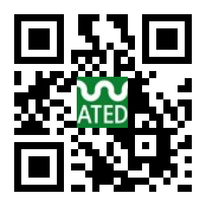

# ¿Qué tal si añades un QR?

En la[ orden 18/5/15](http://www.boa.aragon.es/cgi-bin/EBOA/BRSCGI?CMD=VEROBJ&amp;MLKOB=859076685454) Artículo 12 apartado k: *Sistema de difusión que se hará de la actividad, incluyendo la página Web que se vaya a utilizar*

En el folleto de la actividad, aparte de poner en enlace a la página Web, es una buena idea dar acceso a la dirección cómodamente con un código QR

Los códigos QR sirven para que los móviles, con un simple escaneo entren en una dirección, mapa, ver un texto .... para ello se necesita una APP que escanee códigos QR

#### Acortar la URL mejor !

Recomendamos antes acortar la URL para que el código QR no salga muy redundante, en Internet hay numerosas páginas.

Si ponemos generador de códigos QR en internet nos sale muchísimos, a nosotros nos gusta este [http://www.qrcode.es/es/generador-qr-code/](http://www.qrcode.es/es/generador-qr-code/) que posibilita la inclusión de un logotipo dentro del código.

También cuando proyectamos una información con el proyector y queremos que la audiencia navegue a un sitio determinado

#### Por ejemplo ...

Estamos proyectando un tema muy interesante ;) **"Soportes para la formación del profesorado"** y queremos que la audiencia nos vaya twitteando lo que opinan, en el hastag **#soportesformacion** (lo veremos más adelante) aquí tienes el QR que se proyectaría, pruébalo!!!

tienes que ver más o menos algo así en el móvil 

<a class="twitter-timeline"  href="https://twitter.com/hashtag/soportesformacion" data-widget-id="960878386062249984">Tweets sobre #soportesformacion</a>
